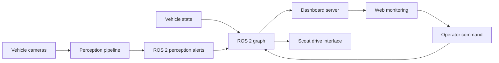

# System Context

이 문서는 개인 기여가 연결된 시스템 문맥만 설명합니다.

## Interface Boundaries

- Perception은 detection·alert 결과를 발행하고 웹 표현 방법을 알지 않습니다.
- Dashboard는 상태와 경보를 표시하지만 모터의 저수준 안전 제어를 담당하지 않습니다.
- Scout 제어는 namespace가 포함된 ROS 2 명령·상태 계약을 통해 중앙 시스템과 연결됩니다.
- Nav2, simulation, controller manager는 팀 시스템의 upstream/downstream 문맥입니다.

## Failure Modes Considered

- 카메라 입력 중단 또는 오래된 frame
- dashboard 연결 끊김
- 서브 차량 heartbeat 중단
- namespace 또는 topic contract 불일치
- 관제 명령과 로컬 안전 제어의 책임 혼동

공개 case study에서는 해당 실패 모드의 설계 의도만 설명하며, 개인 담당 범위를 벗어난 검증 수치는 사용하지 않습니다.
